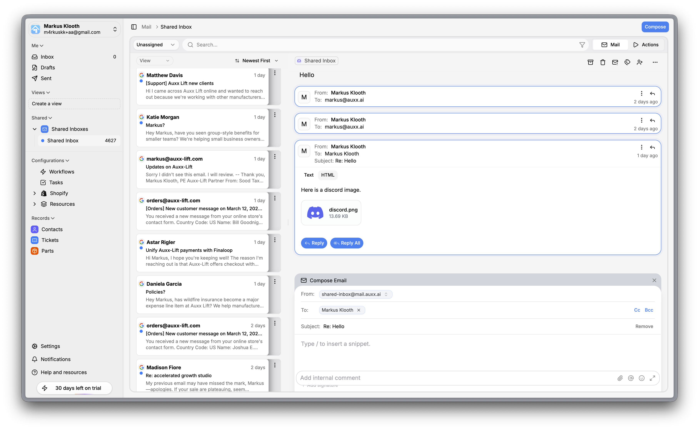
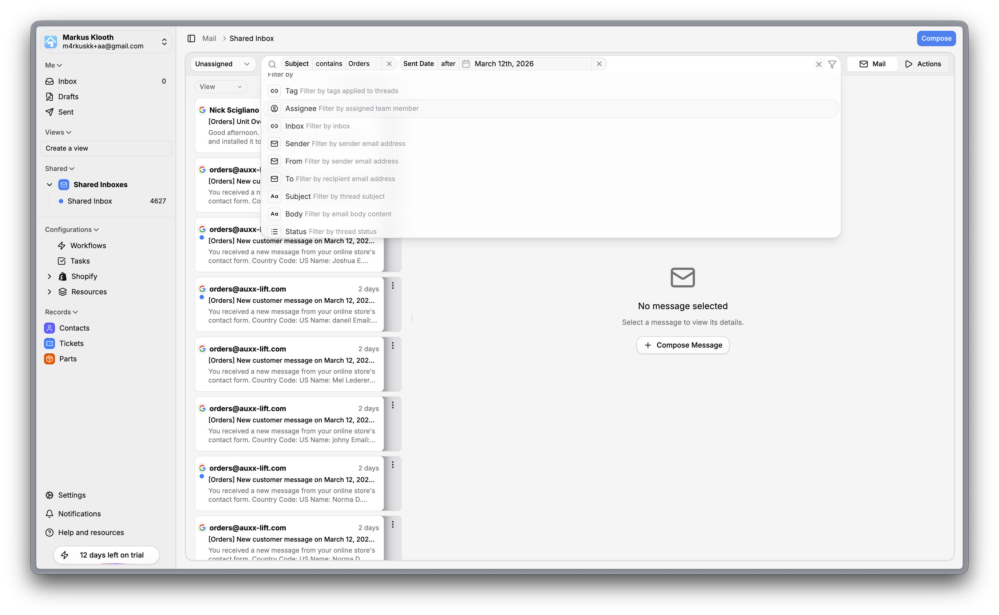
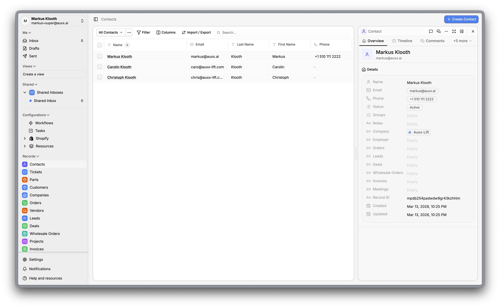
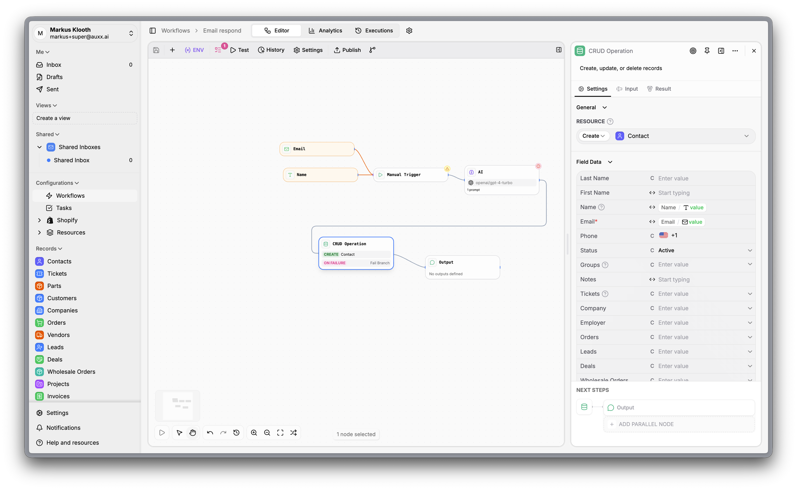
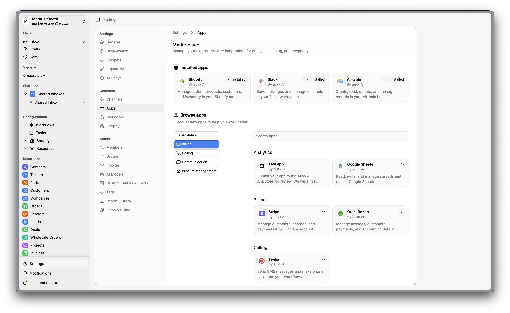
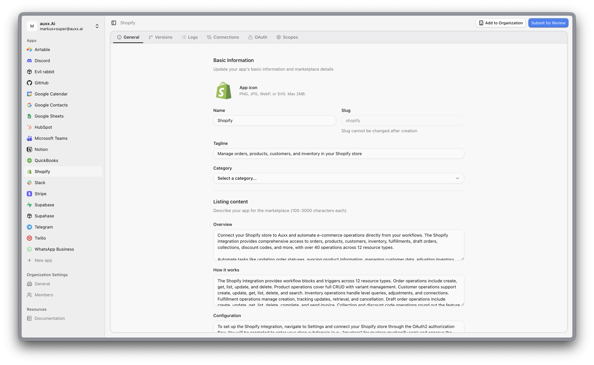
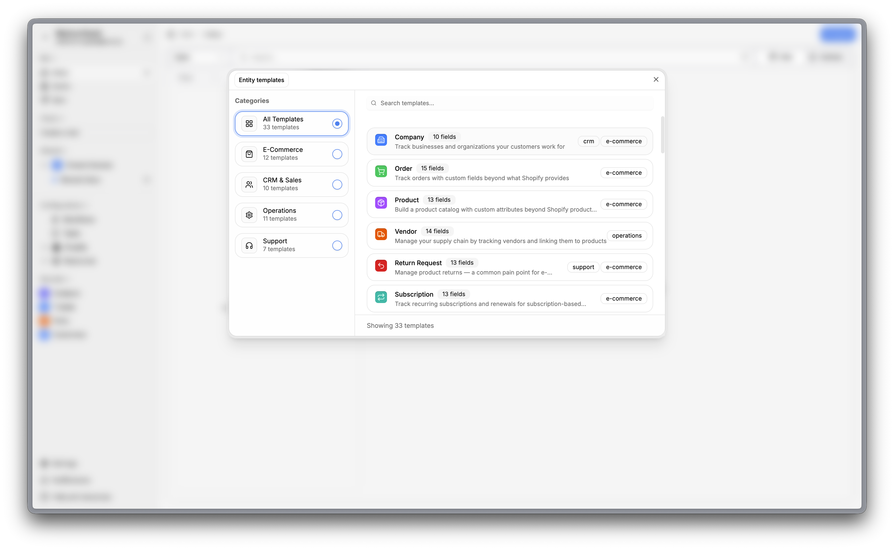
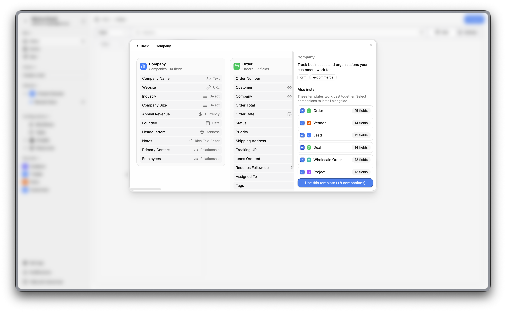
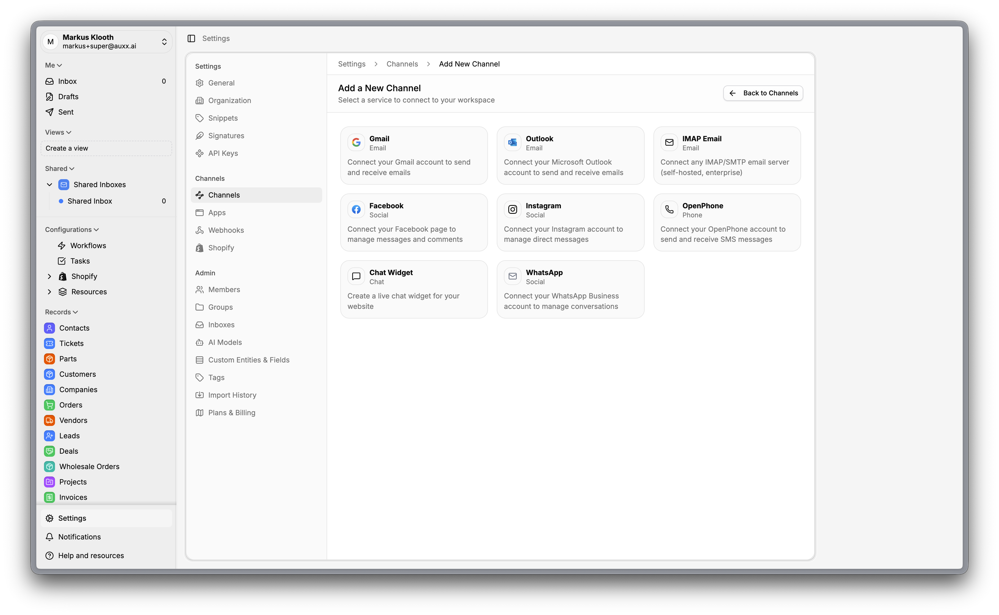

<p align="center">
  
</p>

<p align="center">
  The Open Source Front / Attio meets N8N Alternative.
  <br>
  <a href="https://auxx.ai"><strong>Learn more »</strong></a>
  <br /><br />
  <a href="https://auxx.ai">Website</a>
  ·
  <a href="https://github.com/Auxx-Ai/auxx-ai/issues">Issues</a>
</p>

An open-source AI-powered email support ticket service for Shopify businesses. Integrates with Gmail and Outlook to provide automated customer support with workflow automation.

## Features

- AI-powered automated response generation (OpenAI, Anthropic, Google, Groq)
- Gmail & Outlook email integration
- Shopify integration for customer context
- Workflow automation engine
- Knowledge base for AI context
- Real-time notifications
- Multi-tenant organization support
- Comprehensive ticket management
- Advanced filtering and searching

## Screenshots
<table align="center" style="width: 100%;">
  <tr>
    <td width="50%"></td>
    <td width="50%"></td>
  </tr>
  <tr>
    <td width="50%"></td>
    <td width="50%"></td>
  </tr>
  <tr>
    <td width="50%"></td>
    <td width="50%"></td>
  </tr>
  <tr>
    <td width="50%"></td>
    <td width="50%"></td>
  </tr>
  <tr>
    <td width="50%"></td>
    <td width="50%"></td>
  </tr>
</table>

## Tech Stack

- **Framework**: Next.js 16.1 with React Server Components
- **API**: tRPC v11 with React Query
- **Database**: PostgreSQL with Drizzle ORM
- **UI**: TailwindCSS v4 with shadcn/ui components
- **Forms**: React Hook Form with Zod validation
- **Caching**: Redis
- **Build**: Turborepo
- **Real-time**: Pusher
- **Deployment**: SST (AWS) / Docker / Railway
- **Package Manager**: pnpm

## Prerequisites

- Node.js 22 or later
- pnpm 10.17 or later
- PostgreSQL database
- Redis

## Quick Start

### 1-Click Docker Setup (Recommended)

Run a single command to install and start Auxx.ai:

```bash
bash <(curl -sL https://raw.githubusercontent.com/Auxx-Ai/auxx-ai/main/docker/scripts/install.sh)
```

The install script automatically:

- Checks dependencies (Docker, Docker Compose v2, curl, openssl)
- Downloads `docker-compose.yml` and `.env.example`
- Generates all secrets (database password, Redis password, auth secret, Ed25519 keypair, etc.)
- Detects port conflicts and prompts for alternatives
- Starts all containers and waits for health checks
- Opens the app in your browser

Pin a specific version:

```bash
VERSION=0.1.64 bash <(curl -sL https://raw.githubusercontent.com/Auxx-Ai/auxx-ai/main/docker/scripts/install.sh)
```

Once running, visit `http://localhost:3000` and follow the setup wizard.

## First-time Setup

When you first run the application, you'll be guided through a setup wizard to:

1. Create a super admin account
2. Configure your organization details
3. Set up initial settings

## Environment Variables

| Category       | Variables                                                               |
| -------------- | ----------------------------------------------------------------------- |
| Database       | `DATABASE_URL`                                                          |
| Redis          | `REDIS_HOST`, `REDIS_PORT`, `REDIS_PASSWORD`                            |
| Auth           | `AUTH_GOOGLE_*`, `AUTH_GITHUB_*`                                        |
| Gmail          | `GOOGLE_CLIENT_*`, `GOOGLE_PUBSUB_*`                                    |
| Outlook        | `OUTLOOK_CLIENT_*`, `OUTLOOK_WEBHOOK_*`                                 |
| Shopify        | `SHOPIFY_API_KEY`, `SHOPIFY_API_SECRET`                                 |
| AI Models      | `OPENAI_API_KEY`, `ANTHROPIC_API_KEY`, `GOOGLE_API_KEY`, `GROQ_API_KEY` |
| Email Provider | `EMAIL_PROVIDER`, `MAILGUN_*` or `SMTP_*`                               |
| Storage        | `S3_BUCKET`, `S3_REGION`, `S3_ACCESS_KEY_ID`, `S3_SECRET_ACCESS_KEY`    |
| Payments       | `STRIPE_SECRET_KEY`, `STRIPE_WEBHOOK_SECRET`                            |
| Real-time      | `PUSHER_*`                                                              |

See individual `.env.example` files for complete configuration options.

## Project Structure

```
├── apps/
│   ├── web/              # Main Next.js application
│   ├── api/              # API server
│   ├── worker/           # Background job processor
│   ├── kb/               # Knowledge base app
│   ├── lambda/           # AWS Lambda functions
│   ├── docs/             # Documentation site
│   ├── homepage/         # Marketing site
│   └── build/            # Build utilities
│
├── packages/
│   ├── database/         # Drizzle ORM schema & migrations
│   ├── ui/               # Shared UI components (shadcn)
│   ├── lib/              # Shared utilities
│   ├── config/           # Shared configuration
│   ├── services/         # Business logic services
│   ├── sdk/              # Auxx SDK
│   ├── email/            # Email handling
│   ├── redis/            # Redis client
│   ├── credentials/      # Credentials management
│   ├── billing/          # Stripe billing
│   ├── workflow-nodes/   # Workflow automation nodes
│   ├── logger/           # Logging utilities
│   ├── seed/             # Database seeding
│   ├── eslint-config/    # Shared ESLint config
│   └── typescript-config/# Shared TypeScript config
│
├── infra/                # Infrastructure configs
├── scripts/              # Utility scripts
└── docs/                 # Additional documentation
```

## Development

### Common Commands

```bash
# Start all apps in development mode
pnpm dev

# Build all packages
pnpm build

# Lint and format
pnpm lint
pnpm lint:fix
pnpm format

# Run tests
pnpm test
pnpm test:ui          # With Vitest UI
pnpm test:coverage    # With coverage report
```

### Database Commands (Drizzle)

```bash
# Generate migrations after schema changes
pnpm db:generate

# Run migrations
pnpm db:migrate

# Open Drizzle Studio (database GUI)
pnpm db:studio

# Reset database
pnpm db:reset

# Seed database
pnpm seed
pnpm seed:dev         # Development seed
pnpm seed:test        # Test data seed
```

## Contributing

Contributions are welcome! Please feel free to submit a Pull Request.

1. Fork the repository
2. Create your feature branch (`git checkout -b feature/amazing-feature`)
3. Commit your changes (`git commit -m 'Add some amazing feature'`)
4. Push to the branch (`git push origin feature/amazing-feature`)
5. Open a Pull Request

## Support

If you encounter any problems or have questions, please open an issue on GitHub.
